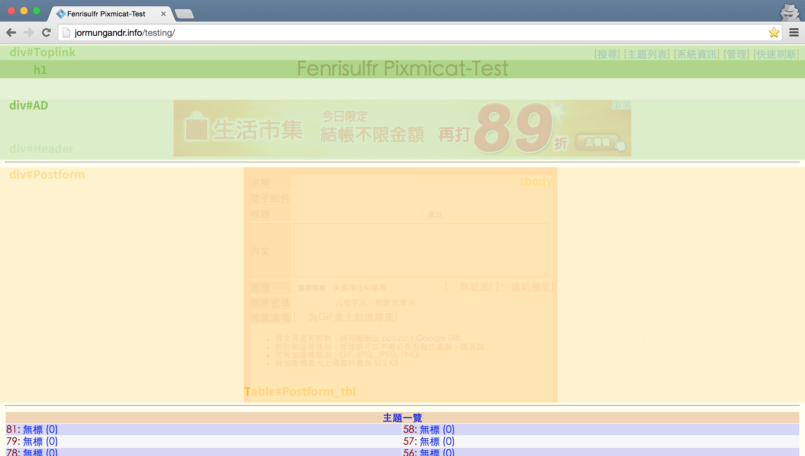
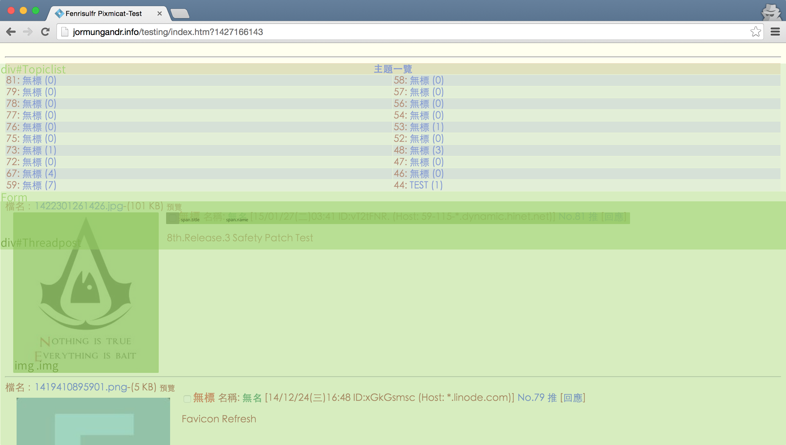
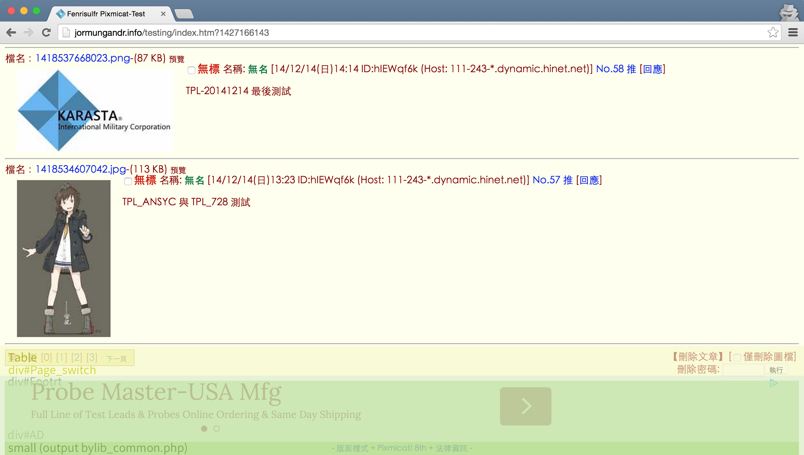
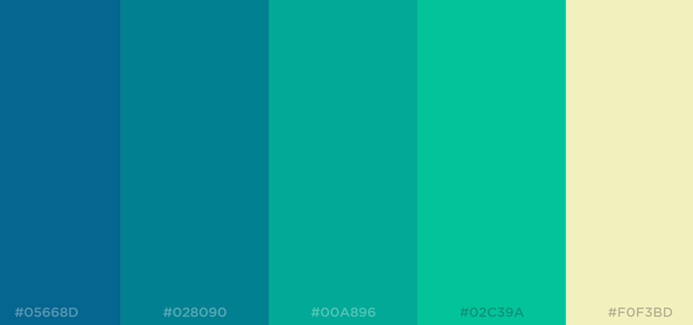
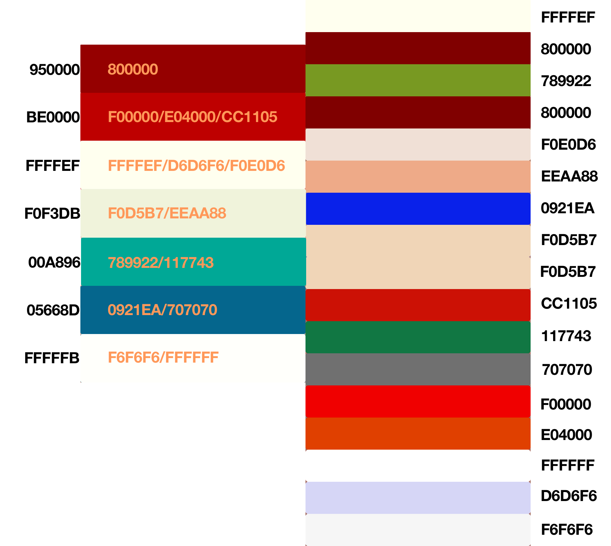

Pixmicat! Imageboard System, The Responsive Template
========

What is this?
-------------
Responsive template for Pixmicat! Imageboard System

Requirements
------------
Pixmicat!-PIO 8th.Release.3 or above

Pixmicat! Default CSS Font/Div Definition
---------

Pixmicat! Css Color Definition
---------
  
  
  

Resources
---------
- Pixmicat in GitHub: https://github.com/scribetw/pixmicat/
- Responsive template Demo https://jormungandr.info/testing/ （Zh-TW）
- Personal Site: https://takahashi65.blogspot.tw/2014/12/pixmicat.html （Zh-TW）